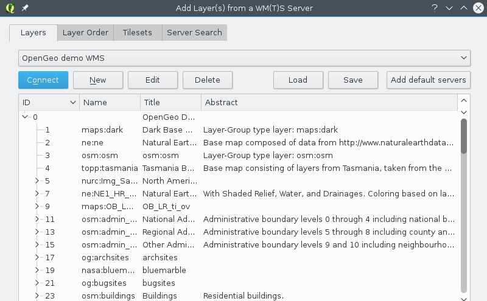

 

WMS是[*web map service*](https://en.wikipedia.org/wiki/Web_Map_Service)的缩写，它是通过专业的GIS软件发布地图的一种流行的方式(尤其是对于非专业的GIS用户)。这个格式与地图瓦片类似，但是更加通用，而且在网络地图中没有像地图瓦片那么好。一个WMS图片由它的角所在的经纬度定义，这个角是是通过Leaflet引擎计算的。

TMS是*tiled map service*的缩写，它是一个更加专注于网络地图的地图瓦片标准，与地图瓦片非常类似的是Leaflet使用`L.TileLayer`类来实例化TMS图层。

## Leaflet中的WMS

当有人发布了一个WMS服务之后，他们中的大多数人都会看到`GetCapabilities`相关的文档。在这个教程中，我们使用Geoserver的地图服务进行演示，可以在这里看到详细内容：http://demo.opengeo.org/geoserver/web/。就像你所看到的，"WMS"章节就是下面的链接：

	http://demo.opengeo.org/geoserver/ows?service=wms&version=1.3.0&request=GetCapabilities

Leaflet并不理解WMS的`GetCapabilities`文档，相反，你可以创建一个`L.TileLayer.WMS`图层，提供基本的WMS链接，并且设置你需要的WMS参数。

基本的WMS链接是一个简单的`GetCapabilities`链接，没有任何参数，例如：

	http://demo.opengeo.org/geoserver/ows?

在Leaflet中使用WMS也是非常简单的：

	var map = L.map(mapDiv, mapOptions);

	var wmsLayer = L.tileLayer.wms('http://demo.opengeo.org/geoserver/ows?', wmsOptions).addTo(map);

一个`L.TileLayer.WMS`需要至少一个选项：`layers`。注意，在Leaflet中"layer"的概念与WMS中"layer"的概念是不同的！

WMS服务定义了一系列的*图层*服务。这些定义在`GetCapabilities` XML文档中，这些内容大多数都是冗长乏味且难以理解的。通过使用一些软件是非常好的想法，例如[使用QGIS来查看WMS服务是否可用](http://www.qgistutorials.com/en/docs/working_with_wms.html)：

我们可以看到OpenGeo的WMS例子中，有一个命名为`ne:ne`的WMS图层作为底图。让我们来使用它：

	var wmsLayer = L.tileLayer.wms('http://demo.opengeo.org/geoserver/ows?', {
		layers: 'ne:ne'
	}).addTo(map);



或者我们可以尝试使用`nasa:bluemarble` WMS图层：

	var wmsLayer = L.tileLayer.wms('http://demo.opengeo.org/geoserver/ows?', {
		layers: 'nasa:bluemarble'
	}).addTo(map);



`layers`选项是一个以逗号分隔的一系列图层。如果一个WMS服务定义了多个图层，然后请求的地图瓦片可以获取超过一个图层的信息。

例如我们正在使用的WMS服务，有一个WMS图层`ne:ne_10m_admin_0_countries`显示了国家陆地和名称，和一个WMS图层`ne:ne_10m_admin_0_boundary_lines_land`显示了国家边界。WMS服务将在一个瓦片上同时请求两个服务，在代码中使用逗号分隔：

	var countriesAndBoundaries = L.tileLayer.wms('http://demo.opengeo.org/geoserver/ows?', {
		layers: 'ne:ne_10m_admin_0_countries,ne:ne_10m_admin_0_boundary_lines_land'
	}).addTo(map);

注意这将在WMS服务中请求一个图片。这与创建一个国家的`L.TileLayer.WMS`不同，它是创建国家的边界图层，并把它添加到地图中。在第一种情况中，有一个图片请求，并且WMS服务决定了如何组合图片（放置到其他图层的顶部）。在第二种情况中，有两个图片请求，并且运行在浏览器中的Leaflet代码可以决定如何组合它们。

如果我们使用[图层控制器](/examples/layers-control.html)来合并图层，那么我们将创建一个看起来不太一样的地图：

	var basemaps = {
		Countries: L.tileLayer.wms('http://demo.opengeo.org/geoserver/ows?', {
			layers: 'ne:ne_10m_admin_0_countries'
		}),

		Boundaries: L.tileLayer.wms('http://demo.opengeo.org/geoserver/ows?', {
			layers: 'ne:ne_10m_admin_0_boundary_lines_land'
		}),

		'Countries, then boundaries': L.tileLayer.wms('http://demo.opengeo.org/geoserver/ows?', {
			layers: 'ne:ne_10m_admin_0_countries,ne:ne_10m_admin_0_boundary_lines_land'
		}),

		'Boundaries, then countries': L.tileLayer.wms('http://demo.opengeo.org/geoserver/ows?', {
			layers: 'ne:ne_10m_admin_0_boundary_lines_land,ne:ne_10m_admin_0_countries'
		})
	};

	L.control.layers(basemaps).addTo(map);

	basemaps.Countries.addTo(map);

点击Countries选项，然后点击boundaries选项，你将看到边界位于陆地的上面，但是WMS是非常智能的来显示顶部的标注。当要求更多的时候如何组合图层是由WMS服务决定的。



### GIS用户使用WMS服务的要点

对于Leaflet中的WMS服务，处理视窗中的一个GIS点是相当基础的。这里不支持`GetCapabilities`，也不支持图例，也不支持`GetFeatureInfo`。

`L.TileLayer.WMS`有额外的选项，详细信息请看[Leaflet's API文档](http://leafletjs.com/reference.html#tilelayer-wms-options)。没有描述的选项将作为WMS服务的`getImage`链接。

同时也要注意Leaflet只支持很少的[坐标系](https://en.wikipedia.org/wiki/Spatial_reference_system)：`CRS:3857`、`CRS:3395`和`CRS:4326`（详细信息请看文档中的`L.CRS`）。如何你的WMS服务在这些坐标系中没有显示内容，你可能需要使用[Proj4Leaflet](https://github.com/kartena/Proj4Leaflet)这个插件，从而在Leaflet是使用其他坐标系。注意在初始化地图和加载WMS服务的时候，请使用正确的坐标系：

	var map = L.map('map', {
		crs: L.CRS.EPSG4326
	});

	var wmsLayer = L.tileLayer.wms('http://demo.opengeo.org/geoserver/ows?', {
		layers: 'nasa:bluemarble'
	}).addTo(map);


	
	
## Leaflet中的TMS

Leaflet没有清晰的表明支持TMS服务，但是瓦片名称结构与`L.TileLayer`的命名规范是非常类似的，所以它经常用来显示TMS服务。

使用同样的OpenGeo WMS/TMS服务示例，我们可以看到TMS的链接如下：

	http://demo.opengeo.org/geoserver/gwc/service/tms/1.0.0

查看[MapCache关于TMS的帮助文档](http://mapserver.org/mapcache/services.html)和[TMS详细信息](https://wiki.osgeo.org/wiki/Tile_Map_Service_Specification)你将会看到TMS的地图瓦片链接的格式如下：

	http://base_url/tms/1.0.0/ {tileset} / {z} / {x} / {y} .png

使用OpenGeo TMS服务作为`L.TileLayer`的实例，我们可以查看capabilities文档（查看例子[`http://demo.opengeo.org/geoserver/gwc/service/tms/1.0.0`](http://demo.opengeo.org/geoserver/gwc/service/tms/1.0.0)），可以看到`tileset`是可用的，创建基本的链接如下：

	http://demo.opengeo.org/geoserver/gwc/service/tms/1.0.0/ne:ne@EPSG:900913@png/{z}/{x}/{y}.png

	http://demo.opengeo.org/geoserver/gwc/service/tms/1.0.0/nasa:bluemarble@EPSG:900913@jpg/{z}/{x}/{y}.jpg

当实例化图层的时候使用`tms:true`选项，如下面代码：

	var tms_ne = L.tileLayer('http://demo.opengeo.org/geoserver/gwc/service/tms/1.0.0/ne:ne@EPSG:900913@png/{z}/{x}/{y}.png', {
		tms: true
	}).addTo(map);

	var tms_bluemarble = L.tileLayer('http://demo.opengeo.org/geoserver/gwc/service/tms/1.0.0/nasa:bluemarble@EPSG:900913@jpg/{z}/{x}/{y}.jpg', {
		tms: true
	});



在**Leaflet 1.0**中添加了一个新的特性，就是可以在URL中使用`{-y}`来代替`tms: true`选项，例如：

	var layer = L.tileLayer('http://base_url/tms/1.0.0/tileset/{z}/{x}/{-y}.png');

在Leaflet 0.7版本中的`tms: true`或者在Leaflet 1.0中的`{-y}`都是必须的，因为`L.TileLayer`的坐标原点在左上角，所以Y坐标向**下**的。在TMS中，原点坐标在左下角，Y坐标上向**上**的。

除了Y坐标的不同，TMS服务的行为都是与`L.TileLayer`一致的。
